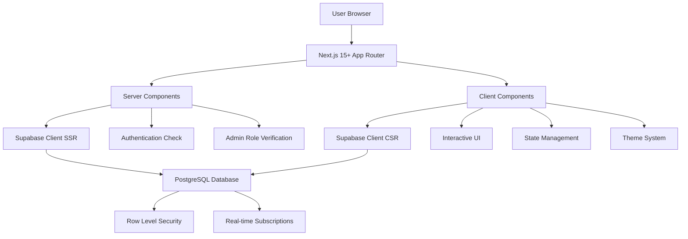

### **docs/architecture.md**

This document provides the AI with a high-level, holistic understanding of the SSTAC & TWG Dashboard system's structure using a simple diagram and text, which is crucial for preventing architectural violations.

# **SSTAC & TWG Dashboard System Architecture**

## **1\. Technology Stack (ACTUAL SYSTEM)**

* **Frontend:** Next.js 15+ with App Router, TypeScript, Tailwind CSS v4
* **Backend:** Supabase (PostgreSQL, Authentication, Real-time features, Edge Functions)
* **Database:** PostgreSQL with Row Level Security (RLS)
* **Authentication:** Supabase Auth + Custom CEW Conference Authentication
* **State Management:** React Context API + localStorage backup
* **Theme System:** CSS Custom Properties with React Context
* **Deployment:** Vercel

## **2\. Component Architecture Diagram**

The system follows Next.js 15+ App Router patterns with clear separation between Server and Client Components:



## **3\. Authentication Flow (DUAL MODE)**

### **Authenticated Users (Supabase Auth)**
1. **Login:** User logs in via Supabase Auth with email/password
2. **Session Management:** Supabase handles JWT tokens and session persistence
3. **Role Assignment:** Automatic role assignment via database triggers
4. **Admin Status:** Comprehensive admin badge persistence system

### **CEW Conference Attendees**
1. **CEW Code Entry:** Users enter CEW code (e.g., "CEW2025")
2. **Session Storage:** CEW code stored in sessionStorage
3. **Poll Access:** Access to CEW-specific polls and surveys
4. **Vote Tracking:** Device-based vote tracking with localStorage

## **4\. Data Flow**

1. **Server-Side Rendering:** Server Components handle authentication, database queries, and initial rendering
2. **Client-Side Interactivity:** Client Components handle user interactions, state management, and real-time updates
3. **API Routes:** Bridge between client components and server actions
4. **Database Security:** Row Level Security (RLS) policies ensure data isolation
5. **Real-time Updates:** Supabase real-time subscriptions for live data updates

## **5\. File Structure (ACTUAL)**

```
src/app/
├── (auth)/                    # Authentication pages
│   ├── login/page.tsx         # Server component for auth
│   └── signup/page.tsx        # Server component for auth
├── (dashboard)/               # Protected dashboard pages
│   ├── admin/                 # Admin-only pages
│   │   ├── page.tsx           # Server component
│   │   └── AdminDashboardClient.tsx  # Client component
│   ├── twg/                   # TWG-specific pages
│   └── cew-2025/              # CEW conference pages
├── api/                       # API routes
│   ├── polls/                 # Poll system endpoints
│   ├── discussions/           # Discussion forum endpoints
│   └── cew-polls/             # CEW-specific poll endpoints
└── cew-polls/                 # CEW poll pages
```

## **6\. Security Architecture**

- **Row Level Security (RLS):** All database tables have RLS policies
- **Admin Role Management:** Automatic role assignment and verification
- **Session Security:** Supabase handles secure session management
- **Input Validation:** All user inputs are validated and sanitized
- **CSRF Protection:** Built-in Next.js CSRF protection

## **7\. Performance Optimizations**

- **Server Components:** Reduce client-side JavaScript bundle
- **Static Generation:** Pre-render static content where possible
- **Image Optimization:** Next.js Image component with optimization
- **Code Splitting:** Automatic code splitting by route
- **Caching:** Supabase query caching and Next.js caching strategies

