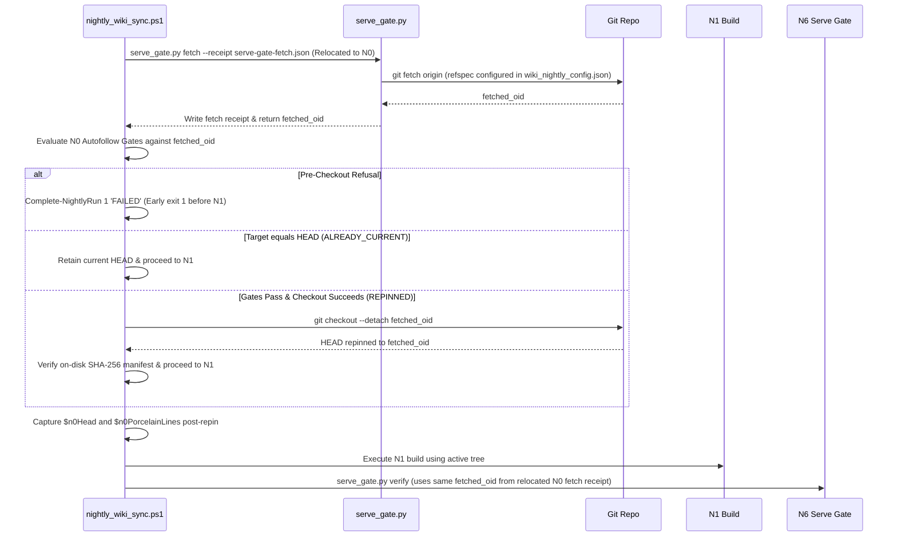

# Wiki Runtime Auto-Follow Bootstrap Design (2026-08-05)

## 1. Executive Summary and Architecture Overview

### 1.1 Owner-Directed Pivot Topology: In-Wrapper Repin at N0
This design specifies the auto-follow repin mechanism for the wiki runtime. Under the owner-directed pivot, the fetch, eligibility decision, and guarded repin take place **INSIDE** `tooling/wiki/nightly_wiki_sync.ps1` at step N0, before the N1 build and before the final `$n0Head` capture.

- **Single Wrapper Process:** Execution occurs entirely within the single `nightly_wiki_sync.ps1` process lineage.
- **Unchanged Scheduled Task Action String:** The installed Windows Task Scheduler task `SSTAC-Wiki-Nightly` action string is **BYTE-FOR-BYTE UNCHANGED**:
  `powershell.exe -NoProfile -NonInteractive -ExecutionPolicy Bypass -File "<runtime>\tooling\wiki\nightly_wiki_sync.ps1" -RepoRoot "<runtime>" -TaskDefinitionId "<guid>" -SkipLabeling -SkipSemantic`
- **Preflight Contract:** `activation_preflight.ps1`'s single-`<Exec>` task definition contract and expected argument byte comparison remain untouched. The terminal receipt schema validation (`Test-TerminalReceiptRawSchema`, lines 749-799) and unit test expectations (`test_activation_preflight.py:660, 1263`) are updated in tandem to validate the 7 new `autofollow_*` fields appended to the receipt schema (see Section 7).
- **Zero Custody Modifications:** `check_orphans.ps1` and `nightly_terminalizer.ps1` remain byte-for-byte untouched.

### 1.2 Load-Bearing Safety Justification
Prior candidates attempted to update the repository tree from an external process launcher, creating process custody contention, interlock gaps, receipt correlation breaks, and exit-code ambiguities.

The historical objection to in-wrapper updates was: *"A script cannot safely rewrite the code it is currently executing."*

That objection **DISSOLVES** under this topology due to disk-level byte identity and two distinct complementary checks:
1. **Pre-Checkout Eligibility Gate (Gate 5):** Uses `git diff --name-only` to enforce that any changes between current `HEAD` and `target_oid` MUST NOT touch the protected pathspec: `wiki/**` (to preserve the zero-tracked-Wiki invariant), `tooling/wiki/**`, root `.gitignore`, root `.graphifyignore`, `AGENTS.md`, root `.gitattributes`, and `tooling/.gitattributes`.
2. **Post-Checkout On-Disk Manifest Equality Proof (Gate 7):** Replaces blob-OID checks by capturing an exact on-disk manifest (relative file path + SHA-256 digest) for every file in the protected pathspec BEFORE checkout and verifying 100% exact byte-for-byte identity AFTER checkout.
3. **Checkout Hook Suppression:** Checkout executes with an explicitly verified empty hooks path (e.g., `-c "core.hooksPath=$env:TEMP\wiki_autofollow_hooks_<cryptographically_random_guid>"`). The empty hooks directory must be uniquely provisioned outside the tracked runtime tree and MUST be created EXCLUSIVELY (creation fails if it already exists -- not "create if missing"). It is verified to be a real directory (not a reparse point / symlink) containing ZERO entries IMMEDIATELY BEFORE the checkout call, not merely at provisioning time. A failure to verify this empty directory is a FAIL-CLOSED precondition and no checkout occurs. Afterwards, ONLY that exact owned directory is removed (never a recursive delete of a parent, never a path the run did not itself create). The unintended `./` resolution from `-c core.hooksPath=` is not used, as its safety is incidental. Mission control's executable evidence disproved that attack and the external reviewer has WITHDRAWN the claim; do not reintroduce it.
4. **Byte-Identical Code Execution:** Because git only writes paths that differ between commits during checkout, `git checkout --detach <target_oid>` will not overwrite or alter any file in the protected pathspec on disk. This is a **LOAD-BEARING** premise of the disk-identity guarantee, empirically verified in `GIT_SEMANTICS_PROOF.json` (a checkout of a file whose blob is UNCHANGED preserves its mtime AND SHA-256). Later script/python executions from disk read byte-identical content from disk.
5. **In-Memory Stability:** PowerShell 5.1 compiles `nightly_wiki_sync.ps1` into memory prior to execution, ensuring in-memory wrapper loop stability.

## 2. Rejected Topologies and Why

The following topologies were evaluated and explicitly REJECTED by the owner:

1. **Candidate A (Two Sequential Task Scheduler Actions):** REJECTED. Multi-action scheduler setups introduce process boundary splits, loss of single-lineage custody tracking, and receipt correlation ambiguities between Action 1 and Action 2.
2. **Candidate B (Asynchronous Non-Blocking Launcher):** REJECTED. Asynchronous detached execution breaks Task Scheduler `LastTaskResult` reporting, creates race conditions with custody baseline evaluation, and obscures exit status.
3. **Candidate C (Custody Exemption for External Launcher):** REJECTED. Requiring `PREEXISTING_BOOTSTRAP_LAUNCHER` exemptions in `check_orphans.ps1` degrades process custody safety guarantees and introduces permanent operational exemptions.
4. **Candidate D (Stateful Supervisory Layer):** REJECTED per owner decision (`OWNER_DECISION_PACKET.md:90`). All stateful supervisory mechanisms were deleted. Under early-termination semantics, any refusal exits native 1 and registers in `LastTaskResult` without extra supervisory state.

All external-launcher and stateful-supervisory designs are dead and must not return.

## 3. Wrapper Insertion Point and Execution Flow

### 3.1 Relocation of Single Fetch and Exact Insertion Location in `nightly_wiki_sync.ps1`
In `tooling/wiki/nightly_wiki_sync.ps1`, the single fetch call currently located at lines 688-700 is **RELOCATED TO STEP N0 ABOVE LINE 685** (and before autofollow gate evaluation).

- **Moved Variables:** The relocation moves lines 688-700, including `$serveGateRunId`, `$serveGateFetchReceipt`, `$promotionCandidate`, `$serveGateFetchRaw`, `$fetchOk`, `$serveGateFetchResult`, and `$serveGateRequiredRef`.
- **Single Fetch Invariant:** N0 autofollow evaluation REUSES this exact relocated N1 fetch result (`$fetchOk`, `$serveGateFetchResult.fetched_oid`). **EXACTLY ONE FETCH** is executed during the wrapper run. No second fetch is added.
- **Insertion Sequence inside N0:**
  1. Process custody baseline capture (`check_orphans.ps1 -Mode CaptureBaseline`) executes at lines 446-450.
  2. Early preflight checks (hook drift lines 660-673, dirty tree lines 675-683) execute.
  3. Relocated fetch (lines 688-700) executes at N0, obtaining `fetched_oid` and `$serveGateRequiredRef`.
  4. N0 Autofollow admission gates evaluate against `fetched_oid`.
  5. If ANY pre-checkout refusal gate fails, the run **TERMINATES EARLY BEFORE N1** via `Complete-NightlyRun 1 'FAILED'`, emitting a valid FAILED terminal receipt with native exit code 1.
  6. If `fetched_oid` equals `HEAD`, decision is `ALREADY_CURRENT` (repin skipped, run continues on `HEAD`).
  7. If gates pass, `git -c gc.auto=0 -c maintenance.auto=false -c "core.hooksPath=$EmptyHooksPath" checkout --detach fetched_oid` executes and post-checkout verification (Gate 7) runs.
  8. `$n0Head` (line 685) and `$n0PorcelainLines` (line 684) are captured **AFTER** autofollow evaluation/repin completes.
  9. Downstream N1 build (line 702+) proceeds using the active (potentially repinned) tree.

### 3.2 Ordering Rationale
- **After Custody Baseline:** Process custody baseline (lines 446-450) captures background processes. Executing `git checkout` in the wrapper process does not alter background process custody.
- **Before `$n0Head` and `$n0PorcelainLines` Capture:** Capturing `$n0Head` and `$n0PorcelainLines` AFTER autofollow evaluation ensures that `$n0Head` records the newly repinned commit OID (or unchanged HEAD) and `$n0PorcelainLines` records tree cleanliness post-repin.
- **Before N1 Build:** Repinning before N1 ensures `gen_docs_scope.py`, graphify update, compilation, and hash computation operate on the updated commit.

## 4. Fail-Closed Early-Termination Admission Gates and Preconditions

Autofollow evaluates admission gates sequentially at N0. If ANY admission gate fails before checkout, repin is refused, the tree is left untouched, and the wrapper **TERMINATES EARLY BEFORE N1** with a valid FAILED terminal receipt and native exit code 1.

All new N0 code is subject to **StrictMode 2.0** (`Set-StrictMode -Version 2.0` set in `nightly_terminalizer.ps1:1` dot-sourced at line 441). Under StrictMode 2.0, accessing a non-existent property on a PSCustomObject throws an exception. Therefore, all JSON property access (such as `fetched_oid`) MUST use guarded property access: `$obj.PSObject.Properties['fetched_oid']` and `$null -ne $obj.PSObject.Properties['fetched_oid'].Value`, followed by explicit `^[0-9a-f]{40}$` regex validation before use. If the fetch failed, `fetched_oid` is represented as JSON `null`.

### 4.1 Universal Git Command Result Contract
Every git invocation in the autofollow block enforces a single unified fail-closed contract:
1. The wrapper captures the exit code, stdout, and stderr separately.
2. The exact expected exit code MUST be verified BEFORE interpreting stdout.
3. Any other exit code is a hard fail-closed refusal, regardless of stdout content.
4. If a command must return a value (e.g. `rev-parse`, `symbolic-ref`), empty stdout with a success exit code is also a hard failure.

The verified expected exit codes used in this design are (based on evidence in `GIT_SEMANTICS_PROOF.json`):
- `symbolic-ref -q HEAD`: 1 (detached), 0 (attached)
- `rev-parse <rev>:<path>`: 0 (present), 128 (missing path)
- `git status --porcelain`: 0
- `git diff --name-only`: 0
- `merge-base --is-ancestor`: 0 (fast-forward), 1 (rewind/divergent)
- `git checkout`: 0

### Gate 1: Detached HEAD Gate
- **Check:** `git -c gc.auto=0 -c maintenance.auto=false -C $RepoRoot symbolic-ref -q HEAD`
- **Condition:** Command must return non-zero exit code (proving `HEAD` is detached).
- **Refusal Action:** Set decision `REFUSED_ATTACHED`, log refusal, terminate early before N1 with exit code 1.

### Gate 2: Clean Working Tree and Linked Worktree Gitdir Gate
- **Check:**
  1. `$gitDir = (git -c gc.auto=0 -c maintenance.auto=false -C $RepoRoot rev-parse --git-dir).Trim()`
  2. `git status --porcelain` must output 0 lines.
  3. Test existence under `$gitDir` of `MERGE_HEAD`, `rebase-merge`, `rebase-apply`, `CHERRY_PICK_HEAD`, and `BISECT_LOG`.
- **Condition:** Tracked state is clean AND no merge/rebase/cherry-pick/bisect operation is in progress.
- **Linked Worktree Note:** Testing `$RepoRoot\.git\MERGE_HEAD` directly is invalid for linked worktrees because `$RepoRoot\.git` is a gitfile. Resolving `$gitDir` via `rev-parse --git-dir` is required.
- **Refusal Action:** Set decision `REFUSED_DIRTY`, log refusal, terminate early before N1 with exit code 1.

### Gate 3: Single-Fetch Target Resolution Gate
- **Check:** Inspect `wiki_nightly_config.json` loading result, then relocated `serve_gate.py fetch --receipt ...` execution output. Guarded property inspection verifies `$null -ne $serveGateFetchResult.PSObject.Properties['fetched_oid']` and `$serveGateFetchResult.fetched_oid -cmatch '^[0-9a-f]{40}$'`. If fetch failed, `fetched_oid` is JSON `null`.
- **Condition:** Configuration is valid, fetch succeeds ($LASTEXITCODE == 0) and yields a valid 40-character hex commit OID (`target_oid`) instead of `null`.
- **Refusal Action:** Set decision `REFUSED_FETCH_FAIL` (with an `autofollow_rejection_reason` denoting config error or fetch error), log refusal, terminate early before N1 with exit code 1.

### Gate 4: Fast-Forward Descendant and Rewind Gate
- **Check:** `git -c gc.auto=0 -c maintenance.auto=false -C $RepoRoot merge-base --is-ancestor HEAD <target_oid>`
- **Condition:**
  - Exit code is 0 (proving `target_oid` is a descendant of `HEAD`).
  - If `HEAD == target_oid`, decision is `ALREADY_CURRENT` (no checkout needed, continue run).
  - If `target_oid` is an ancestor of `HEAD` (rewind) or divergent, gate fails.
- **Refusal Action:** Set decision `REFUSED_DIVERGENT`, log refusal, terminate early before N1 with exit code 1.

### Gate 5: Tooling Diff and Protected Pathspec Gate
- **Protected Pathspec Definition:**
  The protected pathspec consists of `wiki/**`, `tooling/wiki/**`, root `.gitignore`, root `.graphifyignore`, `AGENTS.md`, root `.gitattributes`, and `tooling/.gitattributes`.
- **Check:**
  1. `git diff --name-only HEAD <target_oid> -- wiki tooling/wiki .gitignore .graphifyignore AGENTS.md .gitattributes tooling/.gitattributes` MUST output 0 lines and exit 0. This diff check is MANDATORY and MUST NOT be omitted because only the diff check handles added, deleted, renamed files, and file mode changes.
- **Condition:** No file under `wiki/**`, `tooling/wiki/**`, root `.gitignore`, root `.graphifyignore`, `AGENTS.md`, root `.gitattributes`, or `tooling/.gitattributes` is modified, added, deleted, renamed, or mode-changed between `HEAD` and `target_oid`.
- **Refusal Action:** Set decision `REFUSED_TOOLING_CHANGE`, log refusal, terminate early before N1 with exit code 1.

## 5. Post-Checkout Verification, Hook Suppression, and Fail-Closed Scoping

### 5.1 Post-Checkout Verification Gate (Gate 7)
If all admission gates pass, the wrapper provisions a unique absolute empty hooks directory (e.g. `$EmptyHooksPath`) outside the tracked tree, verifies it contains zero entries, and executes checkout with explicit hook suppression:
`git -c gc.auto=0 -c maintenance.auto=false -c "core.hooksPath=$EmptyHooksPath" -C $RepoRoot checkout --detach <target_oid>`

Immediately after checkout, the wrapper enforces Gate 7:
1. **HEAD Verification:** `git rev-parse HEAD` MUST exit 0, return non-empty stdout, and exactly equal `<target_oid>`.
2. **Clean Status:** `git status --porcelain` MUST output 0 lines.
3. **On-Disk SHA-256 Manifest Verification:** An exact manifest of path plus SHA-256 digest is calculated for every file matching the protected pathspec (`wiki/**`, `tooling/wiki/**`, `.gitignore`, `.graphifyignore`, `AGENTS.md`, `.gitattributes`, `tooling/.gitattributes`). This post-checkout manifest MUST match byte-for-byte the pre-checkout manifest captured before `git checkout`.
4. **Git Directory Integrity:** `rev-parse --git-dir` MUST remain valid with no merge/rebase state.

### 5.2 Pre-Checkout vs Post-Checkout Pre-N1 Early Termination
- **Stale-HEAD Continuation Impossibility:** Continuing execution on a stale `HEAD` after a refusal was previously claimed to exit 0. That claim is invalid: if `HEAD` does not match `required_ref_oid`, N6 serve gate fails (`nightly_wiki_sync.ps1:1090`) and terminalization converts the run to exit code 1 (`nightly_wiki_sync.ps1:580`). Continuing a refused run wastes N1-N5 build compute only to fail at N6 anyway.
- **Unified Early Termination:** All pre-checkout refusals (`REFUSED_ATTACHED`, `REFUSED_DIRTY`, `REFUSED_FETCH_FAIL`, `REFUSED_DIVERGENT`, `REFUSED_TOOLING_CHANGE`) and post-checkout verification failures (`REFUSED_REPIN_VERIFY_FAILED`) terminate early before N1 build.
- **Split Post-Checkout Failure Handling by Trust Closure:**
  - If post-checkout validation fails, but `check_orphans.ps1` and `nightly_terminalizer.ps1` (and their dependencies) STILL MATCH the pre-checkout on-disk manifest, `Complete-NightlyRun 1 'FAILED'` MAY be used and a valid terminal receipt IS claimed.
  - If that closure is MISMATCHED or UNPROVABLE, the wrapper calls the EXISTING already-loaded function `Exit-NightlyTerminalFailure` (which performs `exit 1` internally) and does NOT claim a valid terminal receipt, as the terminalization code itself cannot be trusted. No new bare `exit` is introduced anywhere in the design.
- **Valid FAILED Receipt Verification:** `nightly_terminalizer.ps1:40-60` executes process custody validation (`Assert-SstacSuccessCustody`) ONLY when `$TerminalState -eq 'SUCCESS'`. For `$TerminalState -eq 'FAILED'` under a trusted closure, the terminalizer writes a valid FAILED receipt and exits with native code 1.

### 5.3 Wrapper Script Contract Constraints
All N0 code must adhere to existing wrapper contract constraints in `test_wrapper_contracts.py`:
1. Every terminalization call must match `^\s*Complete-NightlyRun\s+\d+\s+'(FAILED|SKIPPED|SUCCESS)'\s*$` on its own line (`test_wrapper_contracts.py:302-310`). No bare `exit` statements may be introduced.
2. Within 300 characters after any failure log marker string, there must be a matching `Complete-NightlyRun [01] '(FAILED|SKIPPED)'` (`test_wrapper_contracts.py:374`).

## 6. Process Custody, Interlock, and Lock Exemption Rationale

### 6.1 Process Custody
Because repin occurs inside the existing `nightly_wiki_sync.ps1` process, no second independent launcher LINEAGE is spawned. `check_orphans.ps1` and `nightly_terminalizer.ps1` remain 100% UNCHANGED.

### 6.2 Backdoor Prohibition
No production fault-injection parameters (such as `-TestInjectFault`) are added to production scripts. All test coverage uses existing deterministic fixture harnesses (`check_orphans.ps1 -ProcessSnapshotPath` / `-FixtureCheckerPid`, `Read-Rows:324-347`) and unit test fixtures in `test_wrapper_contracts.py`.

### 6.3 Interlock and Lock Exemption Rationale
- **No File Lock Required:** The installed scheduled task carries `MultipleInstancesPolicy: IgnoreNew` (verified in live task XML on 2026-08-05), natively preventing concurrent scheduled instances.
- **Git Index Lock & Publish Guard:** Git's native `.git/index.lock` holds only for individual git commands. Multi-step exclusion is provided by the existing `$headUnchanged` publish guard (`nightly_wiki_sync.ps1:1088`), which verifies `HEAD` has not moved between N0 and N6 before swapping the served wiki.
- **Path Normalization:** `$RepoRoot` is normalized via `[IO.Path]::GetFullPath($RepoRoot).TrimEnd('\','/')` before path composition or token matching.
- **Git Child Suppression:** Git invocations in the autofollow block explicitly pass `-c gc.auto=0 -c maintenance.auto=false`.

## 7. Evidence Recording and Terminal Receipt Schema

Autofollow evidence lands directly in the EXISTING terminal receipt (`terminal-receipt-<run_id>.json`) published by `Publish-NightlyTerminalReceipt`.

### 7.1 Schema Extension (Appended at END of Top-Level Properties)
To prevent breaking `activation_preflight.ps1:749-799` (`Test-TerminalReceiptRawSchema`), which positionally validates `$top[27]` (`n5_post_mutation_scan`) and `$top[28]` (`n5_release`), all 7 new `autofollow_*` fields are **APPENDED AT THE END** of the top-level PSCustomObject ordered hashtable in `nightly_wiki_sync.ps1:605-642` after `terminal_process_custody_evidence`:

36. `terminal_process_custody_evidence` (index 35)
37. `autofollow_starting_head` (string): OID of `HEAD` before repin evaluation.
38. `autofollow_fetched_oid` (nullable string): OID of target returned by single fetch, or JSON `null` if fetch failed.
39. `autofollow_decision` (string): Decision enum value.
40. `autofollow_attempted` (boolean): `true` if `git checkout` was called, `false` otherwise.
41. `autofollow_result` (string): `PASS` (repinned/current), `SKIP` (pre-checkout refusal), `FAIL` (post-checkout failure).
42. `autofollow_final_head` (string): OID of `HEAD` after repin evaluation.
43. `autofollow_rejection_reason` (string): Detailed message if refused or failed, else empty string.

### 7.2 Exact Preflight Raw Schema Expected Array ($expectedTop)
`activation_preflight.ps1:751-763` and `test_activation_preflight.py:660, 1263` are updated to define `$expectedTop` with count 43:
```powershell
$expectedTop = @(
    'schema_version', 'run_id', 'task_definition_id', 'started_at_utc',
    'completed_at_utc', 'duration_seconds', 'terminal_state', 'native_exit_code',
    'n0_orphan', 'n1_build', 'n2_cluster', 'n5_mode', 'n5_skip_labeling',
    'n5_skip_semantic', 'n5_run_label', 'n5_run_semantic',
    'n5_lock_expiry_minutes', 'n5_mutation_attempted',
    'semantic_execution_attempted', 'n5_release_required', 'n5_semantic',
    'n6_wiki', 'n6_publication', 'serve_gate', 'final_canonicalization',
    'final_graph_smoke', 'semantic_evidence', 'n5_post_mutation_scan',
    'n5_release', 'served_graph_sha256', 'required_ref', 'head_oid',
    'required_ref_oid', 'build_stamp_oid', 'terminal_process_custody',
    'terminal_process_custody_evidence',
    'autofollow_starting_head', 'autofollow_fetched_oid', 'autofollow_decision',
    'autofollow_attempted', 'autofollow_result', 'autofollow_final_head',
    'autofollow_rejection_reason'
)
```
Indices 27 (`$top[27]`) and 28 (`$top[28]`) remain completely unchanged and point to `n5_post_mutation_scan` and `n5_release` respectively.

## 8. Single-Fetch Data Flow

Single fetch eliminates double-fetch race conditions:


## 9. Dependency, Configuration, and Cache Consistency Drift Analysis

- **Virtualenv and Pins:** `.venv-graphify` is untracked (gitignored per `.gitignore:175`) and cannot be modified by `git checkout`. `requirements-graphify.txt` is tracked under `tooling/wiki/`, so any change is caught by Gate 5 (`tooling/wiki/**`) and REFUSED.
- **Scope-Control Files:** Root `.gitignore`, root `.graphifyignore`, `AGENTS.md`, root `.gitattributes`, and `tooling/.gitattributes` are included in Gate 5's protected pathspec.
- **Cache Consistency Guarantee via Head OID Hash Composition:**
  In `nightly_wiki_sync.ps1:712-725`, the scan config hash (`$hashBytes`) is updated in tandem to include `$n0Head` (the repinned `HEAD` OID):
  ```powershell
  $hashBytes.AddRange([System.Text.Encoding]::UTF8.GetBytes("$n0Head"))
  ```
  When an auto-followed commit updates the tree, `$n0Head` changes, causing `$hashString` to differ from `.scan_config_hash`. This forces `$forceFull = $true` (lines 727-734) and executes a clean full build, wiping stale extract cache state as mandated by `docs/WIKI_KB_OPERATIONS_2026_07.md:226`.

## 10. Carried-Over Findings Resolution Matrix

| Finding ID | Brief Item | Description | Resolution in Design |
|---|---|---|---|
| C1 | C1 | Exit Code Self-Contradiction | Refusals exit 1 early before N1 build via `Complete-NightlyRun 1 'FAILED'`. `ALREADY_CURRENT` and `REPINNED` continue the run. |
| C2 | C2 | Delete Scope Creep Machinery | Stateful supervisory state, refusal counters, breaker logic, and alert files deleted entirely per `OWNER_DECISION_PACKET.md:90`. |
| C3 | C3 | On-Disk Manifest & Hook Suppression | Protected pathspec adds root `.gitattributes` and `tooling/.gitattributes`. Pre-checkout diff gate and post-checkout on-disk path+SHA-256 manifest proof enforced with `-c "core.hooksPath=$EmptyHooksPath"`. |
| C4 | C4 | Test Ripple Incompleteness | `test_activation_preflight.py` added to test surface (lines 660, 1263). `INT-03` exit code fixed. `TST-01` expected decision fixed. New schema, `.gitattributes`, hook, and manifest tests added. |
| C5 | C5 | Deployment Bootstrap Plan | Section 11 added detailing one-time post-merge manual repin, rebuild, and scheduled canary sequence. |
| C6 | C6 | Git GC/Maintenance Scoping | Section 12 added scoping `-c gc.auto=0 -c maintenance.auto=false` to autofollow git calls and specifying `serve_gate.py:48` tandem alignment. |

## 11. One-Time Post-Merge Bootstrap Deployment Plan

Because auto-follow repin excludes changes to `tooling/wiki/**` via Gate 5, merging this feature into `main` creates a change in `tooling/wiki/**` that the old installed runtime cannot automatically self-deploy. Furthermore, the installed runtime runs the existing wrapper without autofollow capabilities.

To deploy this feature to the live runtime, the following ONE-TIME owner-gated post-merge sequence MUST be executed, matching the successful mission control scheduled canary from 2026-08-05:

1. **Reviewed Merge OID:** Identify the exactly reviewed merge OID.
2. **Hook-Suppressed Repin:** The operator manually fetches and checks out the merge commit on the live runtime root, suppressing hooks via an absolute empty hooks path:
   ```powershell
   $emptyHooks = "$env:TEMP\wiki_canary_hooks_$([guid]::NewGuid().ToString('N'))"
   New-Item -ItemType Directory -Path $emptyHooks -ErrorAction Stop # Fails if exists
   git -C <runtime_root> fetch origin
   git -c "core.hooksPath=$emptyHooks" -C <runtime_root> checkout --detach <reviewed_merge_oid>
   Remove-Item -Path $emptyHooks -Force # Exact dir only, not recursive
   ```
3. **Custody Preflight:** Validate the repo state and process custody baseline.
4. **Automatic ONE-TIME Task Trigger:** An automatic ONE-TIME Task Scheduler trigger is added BESIDE the untouched daily 05:30 trigger.
5. **Resulting Run Verification:** The operator verifies the resulting run succeeds and produces the expected terminal receipt.
6. **Trigger Removal:** The operator removes ONLY the one-time trigger.
7. **Exact Restoration Proof:** The scheduled task XML is proven to be byte-identical to its pre-change hash, the daily trigger remains enabled, and `NextRunTime` correctly points to the next 05:30.

Once this one-time bootstrap sequence is completed, natural nightly runs begin auto-following fast-forward commits on `origin/main` that modify documentation paths outside the protected pathspec.

## 12. Git Child Process Configuration and `serve_gate.py` Alignment

- **PowerShell Autofollow Invocations:** Every git command executed inside the N0 autofollow block in `nightly_wiki_sync.ps1` explicitly includes `-c gc.auto=0 -c maintenance.auto=false`.
- **Python `serve_gate.py` Invocations:** In `tooling/wiki/serve_gate.py` (`run_git` helper, line 48), command flags are updated in tandem to include `-c`, `gc.auto=0`, `-c`, `maintenance.auto=false` in the base argument list to prevent background gc or maintenance process spawning across all python git operations.

## 13. Complete Decision Enum Inventory

| Enum Value | Classification | Meaning | Wrapper Behavior | Native Exit Code |
|---|---|---|---|---|
| `REPINNED` | Success | Clean fast-forward repin succeeded and passed post-verification. | Continue run on new `HEAD` | 0 |
| `ALREADY_CURRENT` | Success | `target_oid` equals current `HEAD`. No repin required. | Continue run on current `HEAD` | 0 |
| `REFUSED_ATTACHED` | Pre-Checkout Refusal | `HEAD` is attached to a branch (not detached). | Terminate early before N1 | 1 |
| `REFUSED_DIRTY` | Pre-Checkout Refusal | Working tree dirty or merge/rebase/cherry-pick in progress. | Terminate early before N1 | 1 |
| `REFUSED_FETCH_FAIL` | Pre-Checkout Refusal | Remote fetch failed, `target_oid` could not be resolved, or config is invalid. | Terminate early before N1 | 1 |
| `REFUSED_DIVERGENT` | Pre-Checkout Refusal | `target_oid` is not a fast-forward descendant of `HEAD` (divergent or rewind). | Terminate early before N1 | 1 |
| `REFUSED_TOOLING_CHANGE` | Pre-Checkout Refusal | Diff touches protected pathspec (`wiki/**`, `tooling/wiki/**`, `.gitignore`, `.graphifyignore`, `AGENTS.md`, `.gitattributes`, `tooling/.gitattributes`). | Terminate early before N1 | 1 |
| `REFUSED_HOOK_SETUP_FAILED` | Pre-Checkout Refusal | Absolute empty hooks directory missing, non-empty, or not exclusively creatable before checkout. | Terminate early before N1 | 1 |
| `REFUSED_REPIN_VERIFY_FAILED` | Post-Checkout Failure | `git checkout` failed or post-checkout manifest/status verification failed. | Terminate immediately fail-closed | 1 |
| `REFUSED_UNEXPECTED` | Early Refusal | Catch-all for unexpected I/O or trap block errors during initialization. | Terminate early before N1 | 1 |
